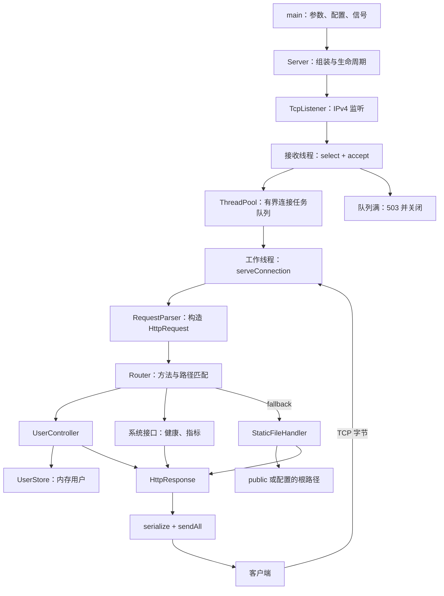
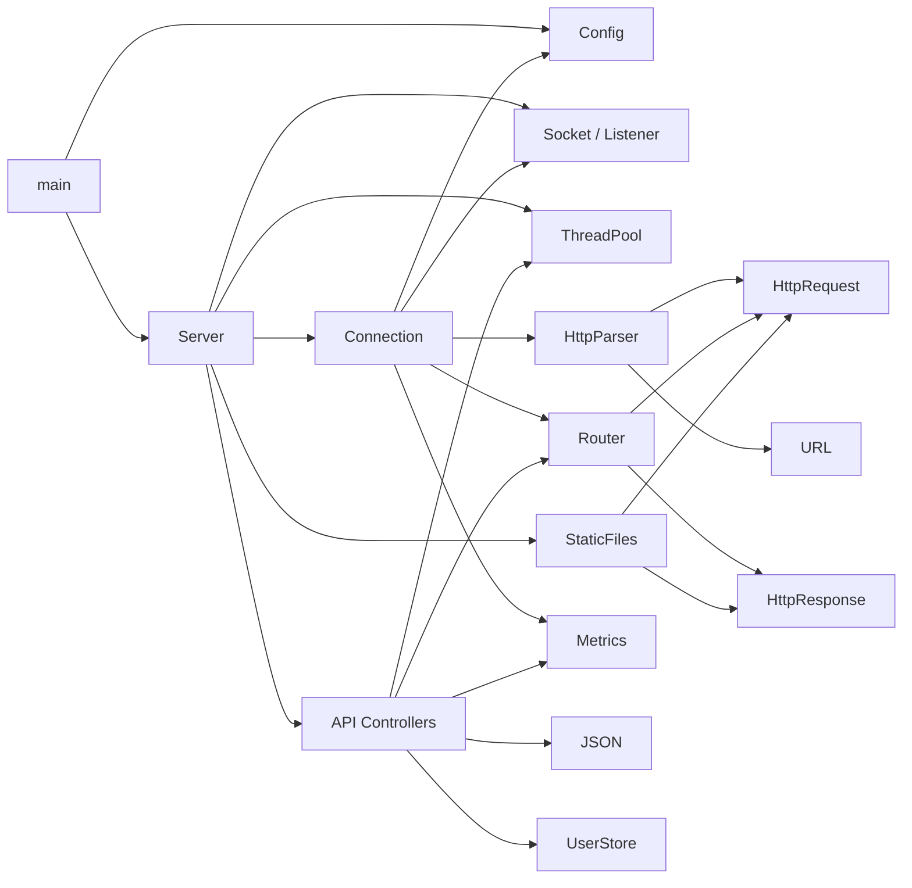

# 03 目录模块与架构

## 目录职责

| 目录或文件 | 职责 | 优先阅读 |
| --- | --- | --- |
| `CMakeLists.txt` | 声明核心库、三个用途的程序和 CTest 项 | 构建目标与链接依赖 |
| `server.conf` | 示例运行参数 | 与 `Config` 代码默认值比较 |
| `src/main.cpp` | 可执行程序的启动和退出控制 | `main()` |
| `src/config/` | 配置文本解析、文件读取和线程数解析 | `Config` |
| `src/server/` | 装配各模块、接收连接、停止服务器；共享计数器 | `Server`、`Metrics` |
| `src/net/` | 系统 socket 封装，以及单连接的 HTTP 执行循环 | `Socket` 与 `Connection` 要分开理解 |
| `src/http/` | HTTP 请求、响应、增量解析、URL 处理、静态文件处理 | `HttpRequest`、`RequestParser`、`StaticFileHandler` |
| `src/routing/` | 注册路由、按方法和路径分发 | `Router` |
| `src/api/` | 用户业务、内存存储、健康与指标接口 | `UserController`、`UserStore`、`SystemController` |
| `src/json/` | JSON 值类型、递归解析和序列化 | `Value`、`parse`、`serialize` |
| `src/threading/` | 固定线程数、有界队列、任务执行和停止 | `ThreadPool` |
| `src/logging/` | 单例日志器、级别过滤、控制台和文件输出 | `Logger` |
| `tests/` | 自制测试框架、单元和集成用例 | `TestFramework`、`test_integration.cpp` |
| `tools/` | 闭环压测客户端 | `BenchmarkClient.cpp` |
| `public/` | 示例网页、CSS、JavaScript | 首页和 `script.js` |
| `docs/` | 原始架构说明；`myDocs/` 是本次分类笔记 | 本目录导航 |
| `cmake-build-debug/` | 本地 CLion 构建产物、缓存和复制的资源 | 用于理解本地配置，不作为源码事实的替代 |
| `.git/`、`.idea/` | 版本控制和 IDE 元数据 | 不参与请求执行 |
| `.agents/`、`.codex/`、`.aws/` | 当前工作区可见的工具辅助目录 | CMake 未引用这些目录，服务器未从这里加载配置 |

## 运行架构图

图中的箭头表示运行时控制或数据流，任务提交跨越了线程边界。

`Server` 是装配中心，决定“接口由谁处理”和“未知路径交给谁”；`serveConnection` 是执行中心，完成“读、解析、分发、写、是否继续”的循环。

## 实际依赖方向

以下是按代码职责拆开的主要依赖，省略标准库和部分日志调用。

几个精确边界：

- `Socket.hpp/.cpp` 不依赖 HTTP 或路由，专注操作系统差异。
- `Connection.hpp/.cpp` 明确依赖 `Router`、`Config` 和 `server/Metrics.hpp`，承担跨模块协调。
- `UserController` 依赖 `Router` 做注册，依赖 HTTP 值类型和 JSON；它不直接收发 socket。
- `SystemController` 还依赖 `Metrics` 和 `ThreadPool`，用于读取指标。
- `HttpParser` 不读取网络或文件；`StaticFiles` 则依赖文件系统和日志。
- `Router` 不包含 `StaticFiles`：它只保存通用的 `RouteHandler`，静态兜底由 `Server` 注入。

因此，不能按目录笼统地说“net 完全不认识路由”“api 不认识路由”或“目录严格单向分层”。`server → net/Connection → server/Metrics` 是目录层面的回指，但 `Metrics` 本身是独立计数结构，连接层没有反向调用 `Server` 控制流程。

代码证据：[Connection.hpp](../../src/net/Connection.hpp)、[UserController.hpp](../../src/api/UserController.hpp)、[SystemController.hpp](../../src/api/SystemController.hpp)、[Server.cpp](../../src/server/Server.cpp)。

## 为什么这种拆分容易学习和测试

请求解析可以直接喂字符串；路由可以直接传入 `HttpRequest`；控制器可以配合一个内存 `UserStore` 调用；静态文件处理可以使用临时目录。只有要检验 socket、线程和完整报文协作时，才需要启动 Server。

这种拆分的代价是连接层仍负责许多事务：网络、超时、HTTP、指标和日志都集中在 `serveConnection`。后续扩展流式上传、异步 I/O 或中间件时，它会是主要调整位置。

下一步阅读 [04核心数据结构与生命周期](04核心数据结构与生命周期.md)，区分模块依赖与对象所有权。
