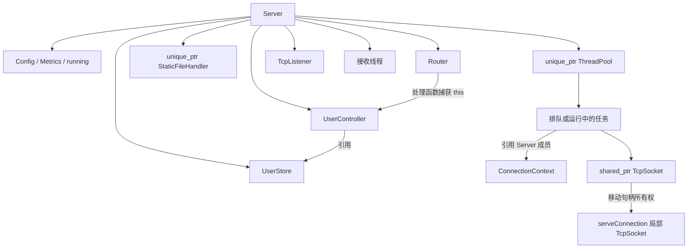

# 04 核心数据结构与生命周期

## 请求、解析器和响应

| 类型 | 核心字段 | 用途 |
| --- | --- | --- |
| [HttpRequest](../../src/http/HttpRequest.hpp#L24) | `method`、`methodText`、`target`、`path`、`version`、`headers`、`query`、`params`、`body` | 从字节流解析出的单个请求 |
| `HeaderMap` | `map<string, string, CaseInsensitiveLess>` | 请求头名称按大小写不敏感规则查找 |
| [ParserLimits](../../src/http/HttpParser.hpp#L11) | 头部、正文、目标长度上限 | 每个解析器的限制 |
| `RequestParser` | `buffer_`、`bodyOffset_`、`contentLength_`、`messageEnd_`、`state_` | 保存增量解析进度和当前请求 |
| [HttpResponse](../../src/http/HttpResponse.hpp#L12) | `status_`、头部键值对数组、`body_` | 与 socket 无关的响应值类型 |

`target` 保留原始目标，例如 `/api/users?name=Ali`，适合日志记录；`path` 是解码和路径规整后的 `/api/users`；`query["name"]` 是 `Ali`；`params["id"]` 由路由匹配填写，与查询串无关。

请求头用 `map` 方便大小写不敏感查找；响应头用 `vector<pair<...>>` 保留添加顺序，并允许 `addHeader()` 添加重名头。`setHeader()` 会查找已有名称并替换首个匹配值。

`HttpRequest& request = parser.request()` 引用解析器内部对象，只应在该解析器存活时使用。`leftover()` 返回指向解析缓存的 `string_view`，不能跨越解析器析构后继续持有，所以连接层将它复制进 `pending`。

## 路由和业务数据

| 类型 | 结构 | 设计含义 |
| --- | --- | --- |
| [RouteHandler](../../src/routing/Router.hpp#L13) | `function<HttpResponse(const HttpRequest&)>` | 同一种签名承载业务接口与静态兜底 |
| `Router::Segment` | 文本 + 是否参数 | 注册时把 `/api/users/{id}` 编译为段数组 |
| `Router::Route` | 方法、原始模式、段数组、处理函数 | 路由保存在 `vector` 中，按注册顺序遍历 |
| [User](../../src/api/UserStore.hpp#L12) | `int id`、`string name`、`string email` | 示例业务实体 |
| `UserStore` | `map<int, User>`、`nextId_`、`shared_mutex` | ID 有序、递增分配；读共享锁、写独占锁 |
| [json::Value](../../src/json/Json.hpp#L21) | `variant<nullptr_t, bool, double, string, Array, Object>` | 一个类型表达所有支持的 JSON 值 |
| `json::Object` | `vector<pair<string, Value>>` | 保留字段顺序，字段查找线性扫描 |

`UserStore::list()` 返回 `vector<User>` 副本，`find()` 返回 `optional<User>` 副本。调用者在锁释放后仍可安全读取结果，但得到的是某个时刻的数据副本，不会随存储继续变化。

JSON 数字统一保存为 `double`，包括由 `int` 构造的用户 ID 和转换后的指标。它不是保持任意大整数精度的数据类型。

## 网络、任务与共享状态

| 类型 | 所有权或语义 |
| --- | --- |
| [TcpSocket](../../src/net/Socket.hpp#L52) | 独占一个已连接句柄；只能移动，不能复制；析构关闭 |
| `TcpListener` | 内部持有一个 `TcpSocket`，用途是监听而不是读请求 |
| `IoResult` | `IoStatus` 与已收/已发字节数；区分成功、关闭、超时、错误 |
| [ConnectionContext](../../src/net/Connection.hpp#L13) | 对 Config、Router、Metrics、运行标志的引用组合，不拥有这些对象 |
| `ThreadPool::Task` | `function<void()>`，队列中保存连接服务任务 |
| [Metrics](../../src/server/Metrics.hpp#L12) | 原子连接数、请求数、发送字节数、按状态码类别计数；各字段独立更新 |
| `Config` | 运行参数值对象，由 Server 保存一份 |

`responsesByClass[6]` 用 `status / 100` 做下标，系统接口对外输出 2xx～5xx。计数使用 relaxed 原子操作，保证单个计数读写不会发生数据竞争，但多个字段合起来不是一个事务快照。

## Server 的对象所有权

### 为什么控制器是成员

[Server.hpp](../../src/server/Server.hpp#L42) 的顺序是 `users_ → userController_ → router_`。控制器引用存储，路由回调捕获控制器的 `this`，因此它们不能是在构造函数结束时销毁的临时对象。C++ 成员按声明顺序初始化、逆序销毁，这个顺序让控制器活得比路由长、存储活得比控制器长。

静态处理器与线程池虽然声明在路由之后，但 `Server::~Server()` 会先执行 `stop()`，等待任务结束；后续销毁路由回调时不会再调用这些捕获对象。保证任务在成员析构前停止才是整体安全的关键。

### 为什么 socket 用 shared_ptr 包装后又移动

[acceptLoop](../../src/server/Server.cpp#L76) 将已接受的 socket 放进 `shared_ptr`，让捕获它的 lambda 可复制，从而满足 `std::function` 的要求。工作线程真正执行时，再把其中的 `TcpSocket` 移动给 `serveConnection`。

这不意味着多个线程应该同时读同一个连接。共享包装解决的是任务可复制问题，实际 I/O 仍由一个工作线程负责；被移动后的包装对象不再拥有有效句柄。

### 为什么 ConnectionContext 在任务内部构造

接收线程会先于线程池退出。如果把接收循环栈上的上下文按引用捕获，排队任务稍后执行时可能读到已销毁对象。当前实现捕获 `Server*`，执行时才引用仍存活的 Server 成员，配合 `stop()` 等待线程池完成来维持生命周期。

## 需要记住的内存成本

解析缓存保存原始报文，`HttpRequest::body` 再持有正文副本；静态文件完整读入字符串；`HttpResponse::serialize()` 又生成完整报文字节串。`HEAD` 正常情况下也先执行处理器、读取文件，只在发送时省略正文。

因此，这套值类型设计容易推理和测试，但它没有零拷贝或流式大文件传输能力。相关流程见 [05主执行链路](05主执行链路.md)。
