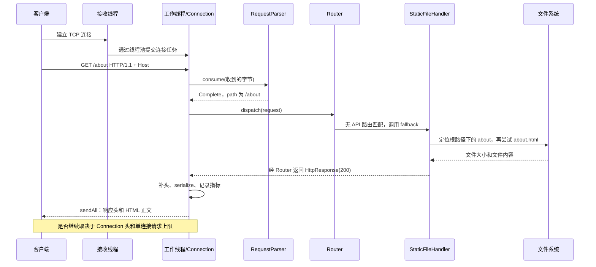

# 05 主执行链路

## 从 main 到监听

入口：[main.cpp:36](../../src/main.cpp#L36)。主线程负责启动和观察退出标志，真正接受连接的是 `Server::start()` 创建的另一个线程。

```text
main(argc, argv)
  ├─ 解析 --config / --port / --root / --log-level
  ├─ 构造 Config 默认值
  ├─ 探测配置文件
  │    ├─ 可打开：Config::loadFromFile → Config::parse
  │    └─ 不可打开：输出提示，继续使用默认值
  ├─ 应用命令行覆盖
  ├─ Logger::setLevel / setLogFile
  ├─ 注册 SIGINT、SIGTERM 处理函数
  ├─ Server(config)
  │    ├─ 成员初始化：Metrics、UserStore、UserController、Router 等
  │    ├─ UserStore 构造时创建 Alice、Bob
  │    ├─ StaticFileHandler：canonical 根路径
  │    ├─ ThreadPool：创建固定工作线程，等待任务
  │    ├─ UserController::registerRoutes：5 条用户路由
  │    ├─ registerSystemRoutes：2 条系统路由
  │    └─ Router::setFallback：静态文件处理
  ├─ Server::start
  │    ├─ TcpListener::bindAndListen
  │    │    └─ 网络初始化 → getaddrinfo → socket → bind → listen
  │    ├─ localPort：读取实际端口
  │    ├─ running_ = true，输出启动日志
  │    └─ 创建接收线程 → Server::acceptLoop
  ├─ 主线程每 100 ms 观察退出标志
  └─ Server::stop
```

Server 构造完成时，路由、静态处理器和线程池已经准备好，监听尚未开始。程序化设置 `Config::port = 0` 可让系统分配端口，集成测试就是这样做的；配置文件文本中的 `port = 0` 则会被拒绝。

## 接收连接并交给工作线程

[Server::acceptLoop](../../src/server/Server.cpp#L76) 的每轮处理如下：

1. 调用 `acceptWithTimeout(200, peer)`，用 `select()` 等待监听 socket 可读。
2. 超时或接收失败返回空值，循环重新检查 `running_`。
3. 接受成功后增加 `connectionsAccepted`，保存对端地址。
4. 将 socket 包装进可复制任务，调用 `pool_->submit()`。
5. 提交成功后，由某个工作线程调用 `serveConnection()`。
6. 提交失败则由接收线程直接发送 `503`、`Connection: close`、`Retry-After: 1`，并记录拒绝数。

一个任务服务一个 TCP 连接的整个生命周期。同一连接内的多个 HTTP 请求不反复提交到线程池。

## 单连接的读取、解析、分发和写回

[serveConnection](../../src/net/Connection.cpp#L38) 是最值得反复阅读的函数：

```text
serveConnection(socket, peer, context)
  ├─ activeConnections++，建立析构时自动减计数的守卫
  ├─ 设置 TCP_NODELAY 和发送超时
  └─ while served < maxRequestsPerConnection
       ├─ 为当前请求创建 RequestParser
       ├─ 先喂入上一请求留下的 pending
       ├─ 设置接收等待期限与最多 250 ms 的读轮询切片
       ├─ NeedMore 时 receive，每次最多 16 KiB
       │    ├─ 收到数据：重置停顿期限，parser.consume
       │    ├─ 超时：观察停止标志和真实期限
       │    └─ 断开/错误：结束连接
       ├─ 只有部分请求且停顿超时：408，然后结束
       ├─ 解析失败：400/413/414/501/505，然后结束
       ├─ Router::dispatch(request)
       │    ├─ 用户或系统 handler
       │    └─ fallback → StaticFileHandler::handle
       ├─ 标准异常：生成 500
       ├─ 记录请求数，计算是否维持长连接
       ├─ 补 Connection 和 Server 响应头
       ├─ writeResponse → serialize → sendAll
       ├─ 更新发送字节/响应类别，写访问日志
       ├─ 发送失败或不保持连接：返回，socket 析构关闭
       └─ pending = parser.leftover()，开始下一次循环
```

这里的 408 分支有前提：连接层确实记住“当前请求收到了部分数据”。只经由 `pending` 带入半个下一请求时，现有判断存在例外，见 [15静态审查问题与改进方向](15静态审查问题与改进方向.md)。

## 以 GET /about 为例



静态文件处理依次检查方法、路径边界、目录或扩展名补全、文件类型、大小，再打开并读取。`/about` 本身没有扩展名且不存在时，尝试 `about.html`。成功响应包含 HTML 的 Content-Type、`Cache-Control: no-cache`，长度由响应序列化器计算。

如果请求是 `HEAD /about`，仍会走到读文件和生成响应正文；正常发送分支调用 `serialize(false)`，保留对应正文长度，但不把正文写到网络。

## POST /api/users 与文件响应在哪处分叉

```text
RequestParser
  → HttpRequest.body 保存 Content-Length 指定的正文
  → Router 匹配 POST /api/users
  → UserController::createUser
  → readUserInput → json::parse → 字段校验
  → UserStore::create：加独占锁，分配 ID，写内存 map
  → json::serialize → HttpResponse(201) + Location
  → Connection 的统一发送流程
```

两条路径共享网络、解析、路由和响应发送机制，分叉点只是路由处理函数。新增用户不会写入 `public`，也不会保存到磁盘。

## 常见结果由哪一层决定

| 情况 | 决策位置 | 结果 |
| --- | --- | --- |
| 未知命令行参数 | `main` | 启动返回码 2 |
| 根路径不可解析、端口绑定失败 | `StaticFileHandler` / `TcpListener` | 启动异常，主程序返回 1 |
| 请求方法 PATCH | `RequestParser::parseRequestLine` | 501，不进入路由 |
| DELETE `/api/users` | `Router::dispatch` | 405，有 Allow |
| GET `/missing` 且没有相应文件 | `StaticFileHandler::handle` | 404 |
| POST 用户正文缺少 name | `UserController` | 400 JSON |
| 处理器抛出标准异常 | `serveConnection` | 500 HTML |
| 连接任务提交失败 | `Server::rejectConnection` | 503 |

不要只凭状态码判断执行到了哪里：400 既可能是 HTTP 报文不合法，也可能是用户 JSON 不符合业务要求；两者的计数、日志和连接处理路径不同。
