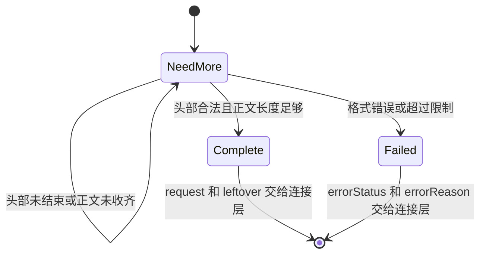

# 08 协议解析与响应生成

代码入口：[HttpParser.cpp](../../src/http/HttpParser.cpp)、[HttpRequest.cpp](../../src/http/HttpRequest.cpp)、[Url.cpp](../../src/http/Url.cpp)、[HttpResponse.cpp](../../src/http/HttpResponse.cpp)。

## 增量解析的输入输出

`RequestParser::consume(string_view chunk)` 接受本次收到的任意长度字节片段。它把字节追加到内部缓存，根据状态返回 `NeedMore`、`Complete` 或 `Failed`，不操作网络、不调用业务接口。



`Complete`、`Failed` 是该解析器实例的终态；再次调用 consume 会直接返回原状态。下一请求使用一个新的解析器，不能把同一实例当成自动重置的多请求解析器。

## consume 的处理顺序

1. 将 chunk 追加到 `buffer_`。
2. 若头部尚未解析，搜索 `\r\n\r\n`。
3. 未找到分隔符时检查累计头部长度，记录下一次搜索位置并返回 NeedMore。
4. 找到后检查头部总长度，包括请求行和分隔符。
5. 依次调用 `parseRequestLine()`、`parseHeaderLines()`、`applyHeaders()`。
6. 保存 `bodyOffset_`，等待 `contentLength_` 指定的字节数。
7. 把正文复制到 `request_.body`，记录 `messageEnd_`，返回 Complete。
8. `leftover()` 返回 `messageEnd_` 之后的字节，供下一请求使用。

搜索位置的关键语句位于 [HttpParser.cpp:55](../../src/http/HttpParser.cpp#L55)：

```cpp
searchOffset_ = buffer_.size() >= 3 ? buffer_.size() - 3 : 0;
```

结束标记长 4 字节，分片可能切在其中任意位置。回退 3 字节既能找到跨片标记，又避免每次都从缓存头部重新搜索。

代码先追加、再检查长度，因此不应描述成“超过限制的字节绝不会进入缓存”。网络层每次读取最多 16 KiB；直接在单元测试中调用 consume 时，调用者也可以传入更大的 chunk。

## 请求行

支持的形态是 `METHOD /path?query HTTP/1.1`，也接受 `HTTP/1.0`。代码按前两个空格拆分，不支持代理请求的 absolute-form 等其他目标形式。

| 检查 | 不符合时 |
| --- | --- |
| 存在两个用于拆分的空格 | 400 |
| 方法是非空合法 token | 400 |
| 版本精确为 HTTP/1.1 或 HTTP/1.0 | 505 |
| 原始请求目标不超过 2048 字节 | 414 |
| 目标非空且以 `/` 开头 | 400 |
| 路径百分号转义可解码 | 400 |
| 方法属于 GET/POST/PUT/DELETE/HEAD | 501 |

这些检查按代码先后发生。某输入同时有多个错误时，返回的是最先遇到的错误，不能把表格理解成多个错误都能独立上报。

## 头部与正文

头部名称按 token 规则验证，名称查找不区分大小写，值两端去空格和 Tab。以空格或 Tab 开头的折行会被拒绝，缺少冒号或空名称返回 400。

重复头部统一使用逗号拼接。`Content-Length` 则要求一个完整的非负十进制数字，不允许逗号，所以重复 Content-Length 即使值相同也会返回 400。

`applyHeaders()` 有三项主要规则：

- HTTP/1.1 必须存在 Host 头；当前未检查 Host 值为空或多次出现。
- 只要存在 Transfer-Encoding 就返回 501，不会尝试解析 chunked。
- 没有 Content-Length 时视为正文长度 0；有值时完整解析为 size_t，超过正文限制返回 413。

因此，POST 缺少 Content-Length 不会由解析器直接返回 411。它会得到空正文，随后用户接口可能因 JSON 不合法返回 400；已经跟在报文后的字节则可能被当成下一请求的候选数据。

解析器不理解 JSON 或 multipart，也不根据 Content-Type 解释正文。正文在这一层只是指定长度的字节字符串。

## URL 解码、规整和查询参数

```text
原始 target：/a/../api/users?name=Ali+Ce&name=Bob&bad=%zz
  ├─ rawPath：/a/../api/users
  ├─ percentDecode(path, plusIsSpace=false)
  ├─ normalisePath → /api/users
  └─ parseQueryString
       ├─ name → "Ali Ce"
       ├─ 第二个 name 被 emplace 忽略
       └─ bad 的解码失败，只丢弃这一对参数
```

路径中的 `+` 保留为加号，查询参数中的 `+` 转为空格。`%00` 被拒绝；非法 `%` 转义出现在路径中会使请求失败，出现在查询串的一对参数里则只忽略该参数。

`normalisePath()` 用段数组消除 `.`、`..` 和重复 `/`。`/../../secret.txt` 会变为 `/secret.txt`，含义变成在 document root 内找文件，而不是访问操作系统根目录。目录尾部 `/` 会尽量保留。

这里的路径字符串处理只是一层规整，最终文件边界仍由静态处理器检查。它不是完整的输入字符校验；例如源码仅显式阻止百分号解码得到的 NUL，没有统一检查原始路径中的所有控制字符。

## 响应如何变成网络字节

处理器返回一个 `HttpResponse`，不直接写 socket。正常连接流程再补上 Connection 和 Server 头，最后调用 `serialize(includeBody)`：

```text
HTTP/1.1 <status> <reason>\r\n
已有响应头（忽略人工设置的 Content-Length）\r\n
Content-Length: <body_.size()>\r\n
\r\n
正文（includeBody 为 true 且状态允许正文时）
```

| 规则 | 当前实现 |
| --- | --- |
| 状态行版本 | 固定 HTTP/1.1，不根据请求版本变化 |
| Content-Length | 按正文的字节数重算，避免与正文长度不同 |
| 正常 HEAD 响应 | `includeBody=false`，保留对应正文长度 |
| 204、304 | 都不输出正文，也不输出 Content-Length |
| 错误页 | `error()` 生成 HTML，转义 `<`、`>`、`&`、双引号 |
| JSON 响应 | `json()` 设置 application/json，但调用者负责事先序列化正文 |

`reasonPhrase()` 中存在 304、411、415 的文本，不意味着默认路由已经实现缓存协商、Length Required 或 Unsupported Media Type 的业务分支。

HEAD 的抑制正文只在正常解析完成后的发送分支执行。解析失败、408 和接收线程的 503 使用独立发送路径，不能把“所有 HEAD 错误响应也无正文”当成已有保证。

## 测试怎样对应这条链路

- [test_http_parser.cpp](../../tests/test_http_parser.cpp)：22 个测试，包括分片头部、分片正文、流水线剩余数据、错误方法/版本/长度和 URL。
- [test_http_response.cpp](../../tests/test_http_response.cpp)：7 个测试，包括长度重算、正常 HEAD、204 和 HTML 转义。
- [test_integration.cpp](../../tests/test_integration.cpp)：HTTP 报文错误、超大正文、HEAD 和超时经过真实连接层的用例。

`WaitsForIncompleteRequest` 实际是喂入三个字符串片段，并不是逐字节喂入。414、重复 Content-Length、空 Host、Connection token 列表和所有分隔符切分位置没有完整的现有用例覆盖。本次只阅读这些断言，未执行测试。
