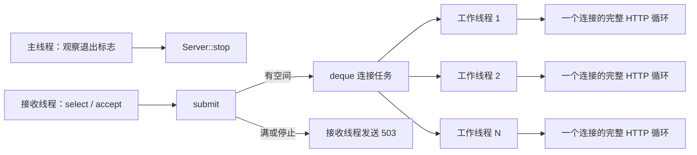

# 11 并发模型与线程池

代码入口：[ThreadPool.hpp](../../src/threading/ThreadPool.hpp)、[ThreadPool.cpp](../../src/threading/ThreadPool.cpp)、[Server.cpp](../../src/server/Server.cpp)、[UserStore.cpp](../../src/api/UserStore.cpp)。

## 线程如何分工

正常运行时，项目自己创建的主要线程数量是 `1 个 main + 1 个接收线程 + N 个工作线程`。日志没有额外后台线程；每条日志由调用它的线程直接写出。



工作线程与连接是一段时间内的一对一关系：线程在该连接关闭前不会回到队列取下一个连接。请求处理完成但 keep-alive 仍等待下一请求时，线程仍被占用。

## 两个队列和正在执行的任务

| 位置 | 控制项 | 含义 |
| --- | --- | --- |
| 操作系统监听积压 | `listen_backlog` | listen 交给内核的连接排队参数，具体语义受系统实现影响 |
| 线程池任务队列 | `max_queued_connections` | 已被 accept、等待工作线程的 socket 任务 |
| 正在执行的连接 | `worker_threads` | 已从队列取出，正在服务或等待数据的连接 |

应用持有的连接通常可理解为“执行中约 N 个 + 队列至多 Q 个 + 接收过程中的临时连接”，不能把 `max_queued_connections` 当成总连接上限，也不能与 listen backlog 混为一谈。

## submit：检查与入队必须在同一把锁内

核心逻辑位于 [ThreadPool.cpp:19](../../src/threading/ThreadPool.cpp#L19)：

```cpp
{
    std::lock_guard<std::mutex> lock(mutex_);
    if (stopping_ || queue_.size() >= maxQueueSize_) {
        return false;
    }
    queue_.push_back(std::move(task));
}
available_.notify_one();
```

停止状态、容量判断和入队处于同一个临界区，否则并发提交可能在检查通过后共同越过容量限制。解锁后通知，可以减少工作线程刚醒来又卡在同一把锁上的情况。

## workerLoop：等待、取任务、释放锁后执行

工作线程等待条件是 `stopping_ || !queue_.empty()`。带谓词的条件变量等待同时处理任务到达、停止通知和虚假唤醒。

醒来后，如果队列为空就退出；否则取走队首任务并出队，然后释放队列锁。真正的 `task()` 在锁外执行，否则一个连接等待网络数据时会阻止整个线程池提交和领取任务。

`busy_` 在执行前后增减，任务异常被 `std::exception` 和 catch-all 分支记录，线程随后继续工作。这和连接层的异常处理不同：连接层仅将标准异常转成 500；非标准异常进入线程池保护后，通常只能结束连接，并不会补一个 500。

## shutdown：停止接收新任务，但领取已有队列任务

`shutdown()` 在锁内把 `stopping_` 设为 true，通知所有工作线程，再逐个 join 并清空线程数组。工作线程只在“队列空”时退出，因此已排队任务会继续被领取。

对于普通计算任务，这可称为排空队列。对于服务器连接任务，任务被领取后还会检查 Server 的停止标志，所以“排队任务执行了”不等于“每个客户端都一定得到完整成功响应”。空闲或尚未发完请求的连接可能在接收超时切片处直接结束。

连续调用 shutdown 会提前返回，现有单元测试覆盖这一点。但这不意味着提供了任意多线程并发调用生命周期函数的完整同步保证。

## 各共享对象如何同步

| 共享对象 | 同步方式 | 使用约束 |
| --- | --- | --- |
| 队列与 stopping | 同一个 mutex | 提交、取任务和停止都持锁 |
| 用户 map 与 ID | shared_mutex | 读共享，写独占，返回副本 |
| 日志输出和文件流 | mutex | 防止多线程输出行互相穿插 |
| 指标计数 | relaxed atomic | 单字段安全，不保证跨字段一致快照 |
| Server 运行标志 | atomic bool | 接收循环及连接超时分支观察 |
| Config、静态根路径 | 启动后只读 | 运行时没有热更新机制 |
| Router 路由数组 | 没有内部锁 | 应在 start 前完成注册，服务中不要修改 |

`Server::router()` 返回可修改引用，但 `Router::add()` 与并发 `dispatch()` 之间没有互斥。因此这个接口适合启动前扩展路由，不能据此推断热注册路由安全。

## 拥塞响应和设计代价

线程池提交失败后，`Server::rejectConnection()` 在接收线程上发送 503，而不是继续扩大队列。这限制了应用层排队内存，但当前拒绝路径没有设置 socket 发送超时，发送还可能占住接收线程。

大量空闲长连接、慢客户端、同步文件读取或慢业务处理都会占住工作线程。增加 worker 数量可以增加同时服务的连接数，也会增加线程栈、调度和内存成本；本次没有进行性能测量。

## 测试与压测读法

[test_thread_pool.cpp](../../tests/test_thread_pool.cpp) 有 5 个测试：提交任务全部完成、满队列拒绝、异常任务后仍存活、重复停止、线程数报告。集成用例 `IntegrationHandlesConcurrentClients` 使用 16 个客户端、各 10 次请求，断言总计 160 次 200。

这些测试没有完整覆盖“网络连接过载返回 503”和“停止时排队连接的耗时”。后者需要特定输入和同步安排，见 [13测试映射与边界验证](13测试映射与边界验证.md)。

[BenchmarkClient.cpp](../../tools/BenchmarkClient.cpp) 是多连接闭环工具：每条连接发一个请求、收一个完整响应，再发送下一个。它按 Content-Length 判断接收完成，没有检查状态码是否为 2xx，因此 `completed` 也可能包含 503/404。工具输出的 requests/sec 不能直接等同于成功业务请求吞吐量。
