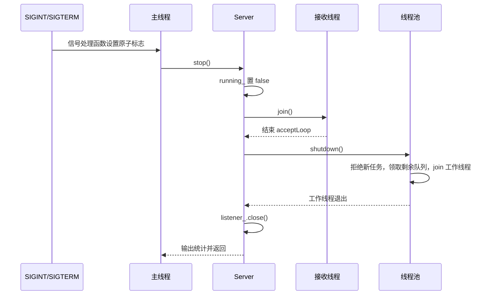

# 12 日志指标与退出

代码入口：[Logger.cpp](../../src/logging/Logger.cpp)、[Metrics.hpp](../../src/server/Metrics.hpp)、[SystemController.cpp](../../src/api/SystemController.cpp)、[main.cpp](../../src/main.cpp)、[Server.cpp:50](../../src/server/Server.cpp#L50)。

## 日志格式和输出位置

日志器是函数内静态对象实现的进程级单例。消息格式为“本地时间戳（毫秒） + 级别 + 文本”，不是 JSON 结构化日志。

```text
年-月-日 时:分:秒.毫秒 [INFO] GET /api/users 200 <处理耗时>ms <对端地址>
```

这是格式示意，不是本次运行日志。

| 级别 | 典型内容 | 输出 |
| --- | --- | --- |
| DEBUG | 空闲关闭、提前断连、关闭期间丢弃连接 | stdout |
| INFO | 监听启动、根路径、访问记录、停止统计 | stdout |
| WARNING | 非法请求、超时、队列满、越界路径 | stdout |
| ERROR | 启动致命错误、处理器异常、任务异常 | stderr |

设置日志文件后，控制台输出仍保留，同时追加文件并逐条 flush。写入由同一个 mutex 保护，避免不同线程的日志行混合；磁盘或控制台慢也会直接拖慢调用线程。

`HS_LOG` 先检查级别，再构造字符串流，降低被过滤日志的格式化开销。级别文本支持全小写或全大写的 debug/info/warning/error，不支持 `warn` 或任意混合大小写。

## 访问日志中的耗时是什么

计时在 `router.dispatch()` 前开始、返回后结束。因此它包括业务处理、JSON 构造或文件读取，**不包括请求接收、排队、解析、响应序列化与网络发送时间**。

日志中的目标是原始 `request.target`，包含查询串。项目没有敏感参数脱敏、请求 ID、日志轮转或异步日志队列。

解析失败和 408 发生在正常访问记录之前，主要走 WARNING 日志；发送失败后仍可能已打印带状态码的访问记录，所以日志中的 200 不保证客户端收到了完整响应。

## 指标的准确口径

`GET /api/benchmark` 读取如下数据：

| JSON 字段 | 何时更新/如何取值 | 容易误解的地方 |
| --- | --- | --- |
| `uptime_seconds` | 从 Metrics 构造时开始计时 | 不完全等于监听开始后的时间 |
| `requests_total` | 完整解析后，路由处理结束时增加 | 不包含解析失败、408、接收阶段 503；含业务错误和转为 500 的标准异常 |
| `connections_accepted` | accept 成功后增加 | 包含之后因队列满而拒绝的连接 |
| `connections_rejected` | submit 失败时增加 | 通常是队列满，也可能是线程池停止 |
| `active_connections` | 进入 serveConnection 加一，作用域结束减一 | 不包含还在任务队列中等待的 socket |
| `bytes_sent` | Connection 的 writeResponse 累加 sendAll 已发字节 | 含头部和部分发送；不含独立 503 拒绝分支的字节 |
| `worker_threads` | 线程池 workers 数组大小 | 不是当前忙碌线程数 |
| `queued_tasks` | 持锁读取待执行队列大小 | 不含正在执行的任务 |
| `responses` | 记录发送尝试的 2xx/3xx/4xx/5xx | 发送失败仍记状态；503 也会进入状态桶 |

指标接口生成正文后，当前这次请求才增加 `requests_total`，发送计数也在随后更新，所以响应快照一般不包含自身完成的请求和发送字节。

多个原子计数依次读取，队列大小另取锁读取；它们不是同一时刻的严格一致快照。也不能期望 `requests_total` 等于所有响应类别之和。

## 信号如何触发退出

`handleSignal()` 只将 `g_shutdownRequested` 设为 true，不在信号处理函数中写日志、join 线程或关闭 socket。主线程每 100 ms 检查标志，观察到后调用 stop。



`Server` 析构会再次调用 stop；通过 `running_.exchange(false)`，重复停止通常直接返回。`Server::wait()` 仅等待接收线程，并不请求停止，`main()` 当前没有使用它。

## 为什么不能承诺 250 ms 内退出

250 ms 是工作线程等待网络时观察关闭标志的切片常量，不是整个程序的停止期限。还有以下影响：

- main 最多要等一个约 100 ms 的观察周期，接收线程也有约 200 ms 的 select 轮询周期；它们可能部分重叠。
- 已执行的 handler 没有被中断或设置业务执行期限，阻塞文件 I/O 也需完成或出错。
- `sendAll()` 的循环及单次发送超时不构成整个退出流程的绝对截止时间。
- 停止标志只在 receive 返回 Timeout 时检查，持续有数据的连接可能继续处理。
- 多个排队空闲连接会被分批领取，各批都可能等待一个接收切片。
- 接收线程发送拒绝响应时没有配置发送超时。

因此，代码有缩短空闲连接退出等待的设计，但不能直接沿用 README 中的“约 250 ms 有界退出”作为所有负载下的保证。本次没有测量退出时间。

信号方案还依赖所用平台上该原子操作符合信号处理要求；源码未对 `atomic<bool>` 是否始终 lock-free 做静态断言。

## 停止之后是否能重启同一个对象

`start()` 可以再次绑定，但 `stop()` 已将线程池永久置为 stopping，并清空工作线程；`start()` 不重建线程池。从代码判断，停止后对同一对象再次 start 不能恢复正常服务。应将当前生命周期理解为“构造 → start → stop → 析构”。

现有测试没有日志专用用例，也没有 SIGINT/SIGTERM、长队列退出耗时和 Server 重启用例。线程池的重复 shutdown 测试不能替代这些验证。
